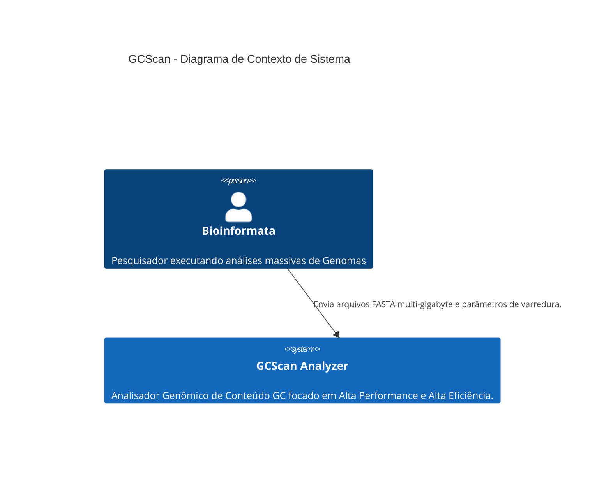
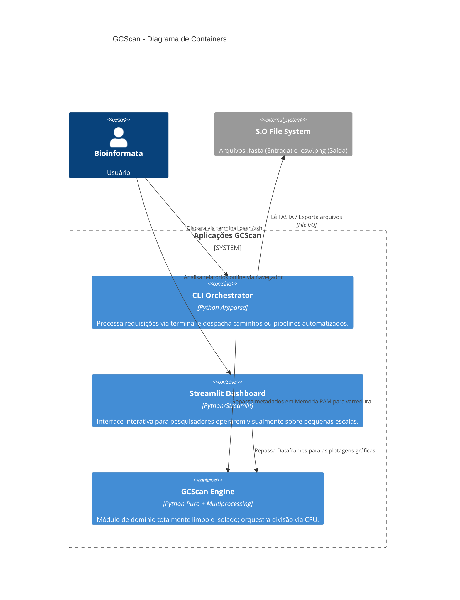
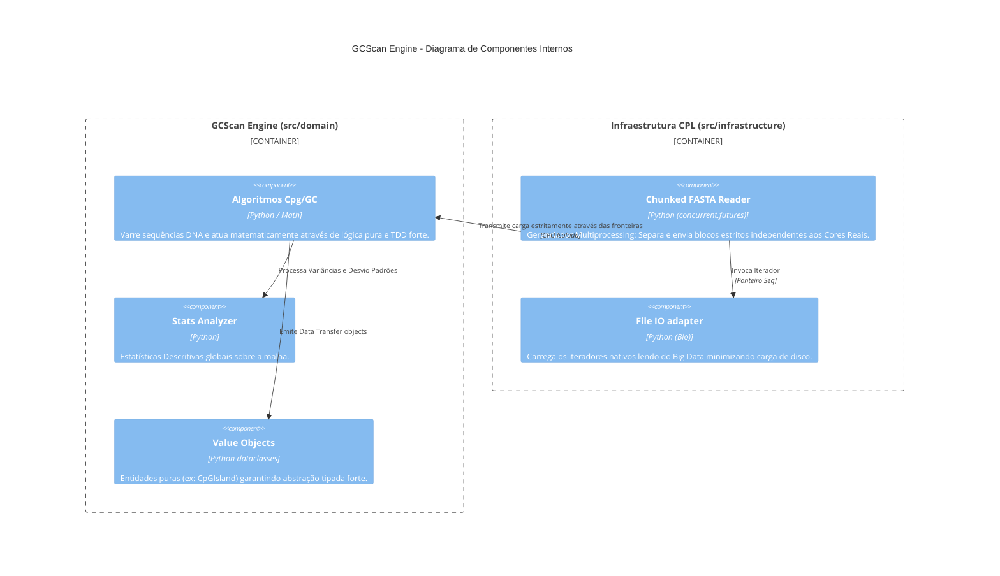

# GCScan v2.0 - Documentação de Arquitetura (C4 Model)

Este documento mapeia o coração da arquitetura técnica do GCScan, guiada imperativamente pelos princípios de Clean Architecture, AI-XP e abstrações seguras para a versão de Alta Performance.

## 1. Contexto do Sistema (Nível 1)
Descreve as interações em alto nível do analisador e o papel do domínio.

## 2. Diagrama de Containers (Nível 2)
Expansão das responsabilidades focada em manter a **Dependency Inversion**. Infraestruturas dependem do Núcleo, o Núcleo nunca conhece a ponta.

## 3. Diagrama de Componentes (Nível 3)
Detalhando o GCScan Engine e como o sistema distribui a carga da versão 2.0 (Multiprocessing FASTA Parser).

## Aderência a Regras (Zero Vibe Coding)
1. **Domínio Independente**: Nenhuma seta do componente `GCScan Engine` sai para o File System, Bibliotecas de Plots, ou Protocolos de Rede. Essa barreira lógica é garantida no Continuous Integration através da validação AST.
2. **Economia I/O**: `Chunked FASTA Reader` distribui cópias particionadas nas instâncias de Multiprocess sem estourar o limite de `memory/RAM`.
